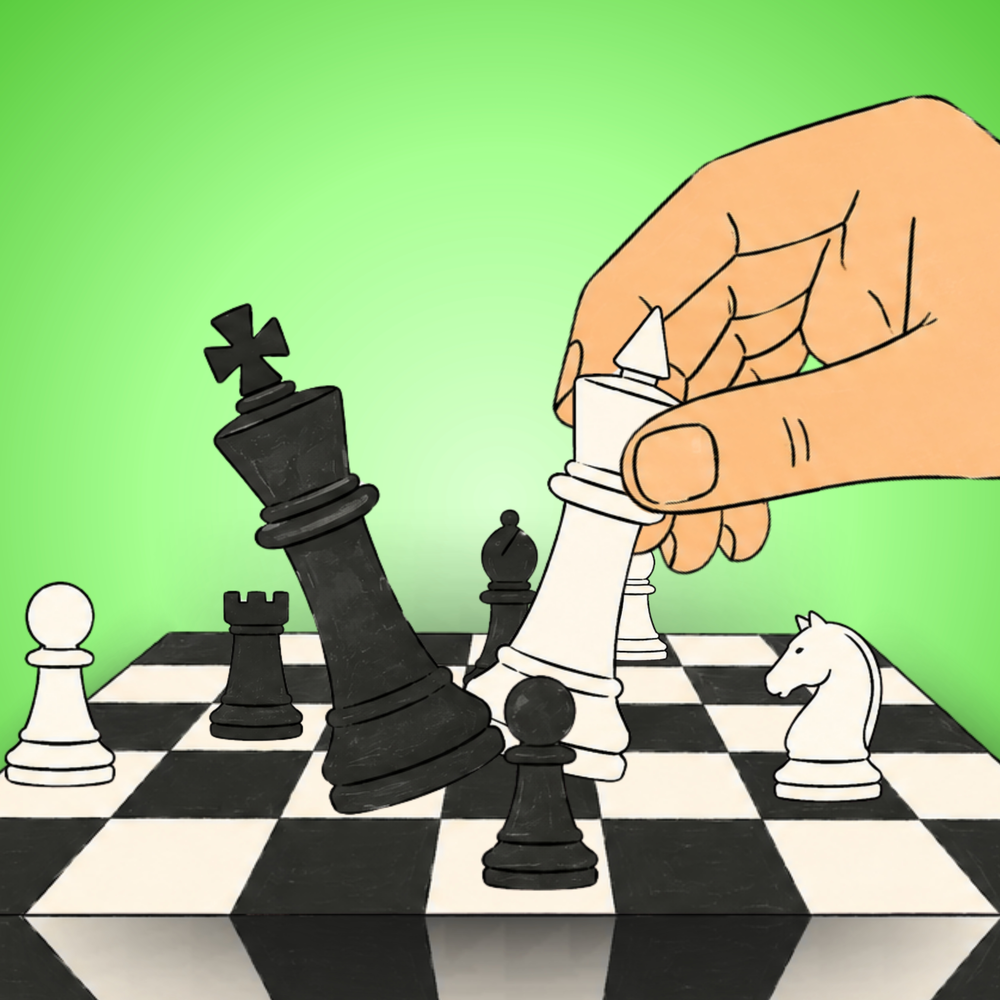

# ♟️ Chess Runner: King Dash

<p align="center">
  
</p>

<p align="center">
  <b>Un híbrido táctico e hipercasual entre arcade de scroll vertical y ajedrez en tiempo real.</b>
</p>

<p align="center">
  
  
  
  
</p>

---

## 📖 Acerca del Juego

**Chess Runner: King Dash** combina la velocidad de los juegos estilo *Endless Runner* con la profundidad táctica del ajedrez tradicional. Controlas al **Rey** en un tablero de 5 columnas en constante movimiento hacia arriba. Tu objetivo es esquivar los patrones de ataque de las piezas enemigas en tiempo real, recoger *power-ups* dinámicos y sobrevivir la mayor distancia posible.

> **¡No hay jaque mate, hay supervivencia táctica!** Un solo movimiento en falso dentro del vector de ataque enemigo significa la derrota instantánea.

---

## ✨ Características Principales

- 🎮 **4 Modos de Juego Diversos:**
  - **Clásico:** Modo relajado donde la cámara acompaña tu progreso a tu propio ritmo.
  - **Supervivencia (Infinito):** La cámara sube automáticamente aumentando su velocidad gradualmente. ¡Muévete rápido o la pantalla te alcanzará!
  - **Contrarreloj:** Tienes 60 segundos para avanzar lo más lejos posible en el tablero.
  - **Tutorial (3 Niveles):** Diseñado para aprender progresivamente las amenazas de Peones, Caballos y Alfiles.

- ⚡ **Sistema de Power-Ups:**
  - 🛡️ **Escudo:** Te otorga invulnerabilidad temporal contra un impacto directo.
  - 🔄 **Cambio de Pieza:** Te transforma temporalmente en Torre, Alfil, Caballo o Reina, otorgándote sus patrones de movimiento únicos.
  - 💥 **Sacudir / Tumbar Mesa:** Elimina enemigos aleatorios o limpia por completo la pantalla.
  - 🤖 **IA Auto-Play:** Deja que un algoritmo analice la ruta más segura y juegue por ti durante unos segundos.
  - ⏱️ **Reloj:** Aplica un efecto de cámara lenta (*slow-motion*) a la presión del juego.

- 🎨 **Personalización Visual:**
  - **5 Estilos de Tablero:** Clásico, Azul, Oscuro, Verde y Normal HD con sus respectivas sombras adaptativas.
  - **Piezas Personalizables:** Elige jugar con el set de piezas Blancas o Negras.

- 💾 **Persistencia y Nube:**
  - Base de datos SQLite local para registro de puntuaciones e historial de partidas.
  - Sistema de **Sincronización Silenciosa** con API REST remota para usuarios registrados e invitados.

---

## 🛠️ Arquitectura Técnica

El proyecto está desarrollado en **Java** bajo el marco de desarrollo **libGDX**, utilizando una arquitectura modular limpia orientada a componentes:


```

proyectosexto/
├── core/                  # Lógica principal del juego (Pantallas, UI, Entidades, BD)
│   ├── src/main/java/com/brk/chessrunner/
│   │   ├── database/     # Modelos y controladores SQLite locales
│   │   ├── network/      # Cliente HTTP para sincronización REST
│   │   ├── ui/           # Componentes de interfaz (Scene2D: PauseWidget, Personalizacion, etc.)
│   │   ├── GameScreen.java
│   │   ├── GestorEnemigos.java
│   │   └── MainGame.java
├── android/               # Módulo específico para Android (Launcher, SQLite Manager)
├── lwjgl3/                # Módulo para ejecución en Escritorio (Desktop LWJGL3)
└── assets/                # Texturas, fuentes TTF, skins de UI y shaders

```

### Tecnologías Utilizadas
- **Core Framework:** [libGDX](https://libgdx.com/)
- **UI System:** Scene2D, Table Layouts & Custom Skin
- **Viewport:** `FitViewport` (Mundo virtual nativo de 480 × 800)
- **Generación Procedural & Pathfinding:** Algoritmo de generación BFS en `GestorEnemigos` garantizando la existencia de caminos seguros.
- **Persistencia Local:** SQLite DB + LibGDX `Preferences`

---

## 🚀 Instalación y Ejecución

### Prerrequisitos
- JDK 17 o superior.
- Android Studio (Recomendado) o IntelliJ IDEA.
- Android SDK (API 26+).

### Clonar el Repositorio
```bash
git clone [https://github.com/rafaga123/proyectosexto.git](https://github.com/rafaga123/proyectosexto.git)
cd proyectosexto

```

### Ejecutar en Escritorio (Desktop)

Puedes probar el juego en tu PC ejecutando el target de LWJGL3 mediante el Wrapper de Gradle:

```bash
# En Linux / macOS:
./gradlew lwjgl3:run

# En Windows:
gradlew.bat lwjgl3:run

```

### Compilar e Instalar en Android

Conecta tu dispositivo móvil con depuración USB o inicia un emulador y ejecuta:

```bash
./gradlew android:installDebug android:run

```

---

## 🎯 Demostración de Juego / Capturas

| Menú Principal | Selección de Modos | Gameplay | Personalización |
| --- | --- | --- | --- |
| *(Agrega tu captura)* | *(Agrega tu captura)* | *(Agrega tu captura)* | *(Agrega tu captura)* |

---

## 🤝 Contribución

Las contribuciones son bienvenidas. Si deseas proponer una mejora o corregir un bug:

1. Haz un **Fork** del proyecto.
2. Crea tu rama de características (`git checkout -b feature/NuevaCaracteristica`).
3. Realiza un **Commit** con tus cambios (`git commit -m 'Añade nueva característica'`).
4. Haz un **Push** a la rama (`git push origin feature/NuevaCaracteristica`).
5. Abre un **Pull Request**.

---

## 📜 Licencia

Distribuido bajo la Licencia MIT. Consulta el archivo `LICENSE` para obtener más información.

```

```